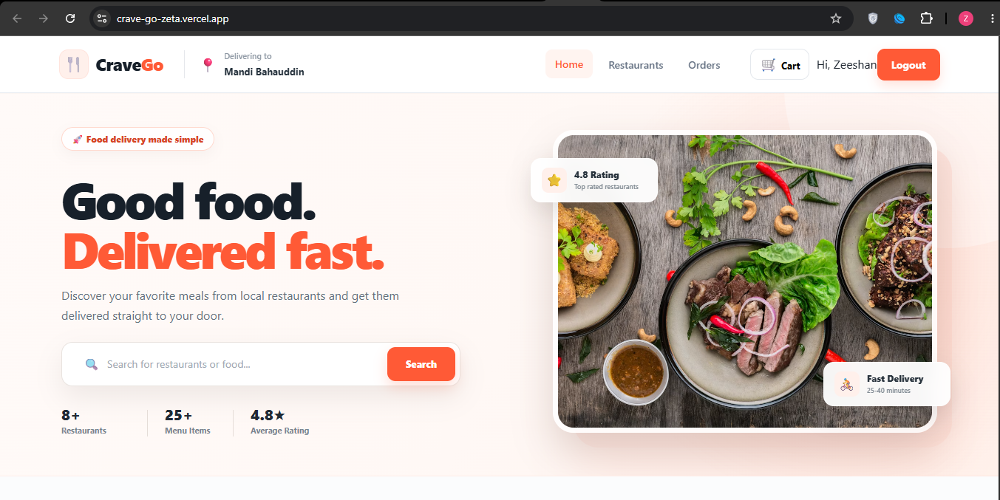
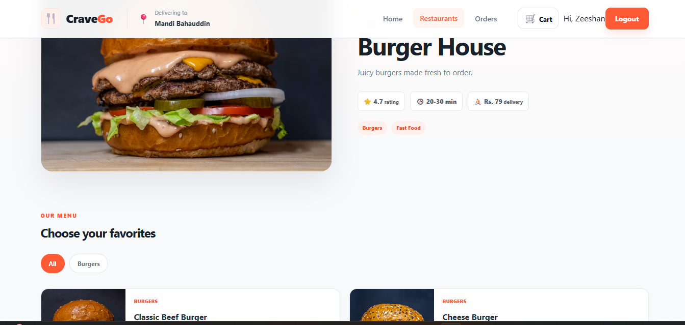
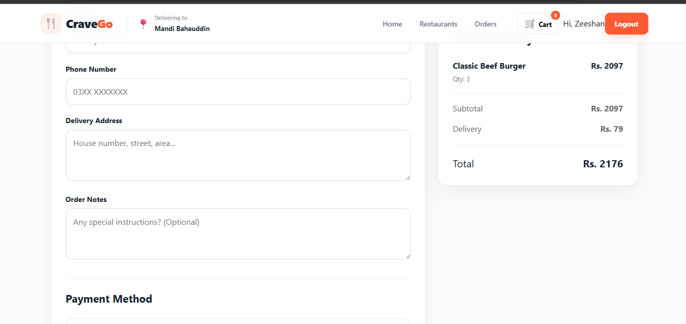
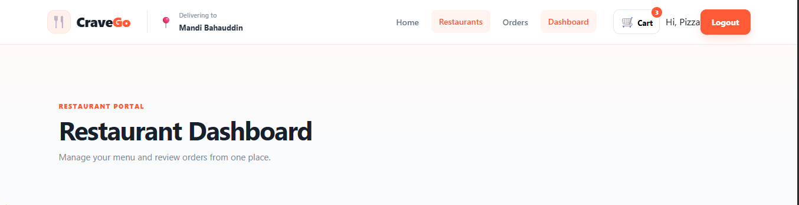

# 🍴 CraveGo

CraveGo is a full-stack food ordering web application that connects customers with local restaurants. Users can browse restaurants and menus, create an account, add food to their cart, place orders, and view their order history.

The application also includes dedicated restaurant and admin dashboards for managing menus, restaurants, and customer orders.

## 🌐 Live Demo

**Live Application:**  
https://crave-go-zeta.vercel.app/

## ✨ Features

### Customer
- Browse local restaurants
- Search restaurants and filter by category
- View restaurant menus
- Add and remove items from cart
- Order from multiple restaurants
- Automatic delivery-fee calculation
- User signup and login
- Secure JWT-based authentication
- Place food orders
- View previous orders and order status
- Cash on Delivery checkout

### Restaurant Dashboard
- Restaurant-specific dashboard
- View restaurant statistics
- View incoming orders
- Update order status
- Add new menu items
- Edit existing menu items
- Delete menu items

### Admin Dashboard
- Admin-only access
- Manage restaurants
- View application data
- Manage platform operations

## 🛠️ Tech Stack

### Frontend
- React
- TypeScript
- Vite
- CSS
- Fetch API

### Backend
- Node.js
- Express.js
- REST API
- JWT Authentication
- bcryptjs

### Database
- Supabase
- PostgreSQL

### Deployment
- Vercel — Frontend
- Railway — Backend
- Supabase — Database
- GitHub — Version Control

## 🏗️ Architecture

```text
React + TypeScript Frontend
          │
          │ HTTPS / REST API
          ▼
Node.js + Express Backend
          │
          │ Supabase Client
          ▼
Supabase / PostgreSQL
```

The frontend and backend are deployed separately. The React frontend communicates with the production Express API through REST endpoints.

## 🔐 Authentication

CraveGo uses JWT-based authentication.

After a successful login or signup, the backend generates a token that is used to authenticate protected API requests.

Role-based access is used to provide separate functionality for:

- Customers
- Restaurants
- Administrators

Sensitive backend credentials are stored using environment variables and are not committed to the repository.

## 📦 Order System

Customers can:

1. Browse restaurants
2. Select menu items
3. Add items to their cart
4. Enter delivery information
5. Place an order
6. View the order in their order history

Restaurants can then view their orders and update their status through the restaurant dashboard.

Supported order statuses include:

```text
Placed
Preparing
Out for delivery
Delivered
```

## 📁 Project Structure

```text
CraveGo/
│
├── src/                    # React frontend
├── public/                 # Public assets
├── backend/
│   ├── config/             # Backend configuration
│   ├── controllers/        # API business logic
│   ├── middleware/         # Authentication and role middleware
│   ├── routes/             # Express API routes
│   ├── server.js           # Express server
│   └── package.json
│
├── index.html
├── package.json
├── vite.config.ts
└── README.md
```

## ⚙️ Local Development

Clone the repository:

```bash
git clone https://github.com/Zeeshan-Warraich/CraveGo.git
cd CraveGo
```

Install frontend dependencies:

```bash
npm install
```

Start the frontend:

```bash
npm run dev
```

Install backend dependencies:

```bash
cd backend
npm install
```

Create a `.env` file inside the backend directory and configure the required environment variables.

Then start the backend:

```bash
npm run dev
```

## 🌍 Production

The application uses separate production services:

```text
Frontend → Vercel
Backend  → Railway
Database → Supabase
```

The frontend uses the `VITE_API_URL` environment variable to communicate with the deployed backend.

## 🎯 Project Purpose

CraveGo was built as a full-stack learning and portfolio project to gain practical experience with modern web application development.

The project provided hands-on experience with:

- React application development
- TypeScript
- REST API development
- Express.js
- Database integration
- Authentication and authorization
- CRUD operations
- Frontend/backend communication
- Git and GitHub
- Environment variables
- Production deployment

## 👨‍💻 Developer

**Muhammad Zeeshan Faiz**

GitHub:  
https://github.com/Zeeshan-Warraich
